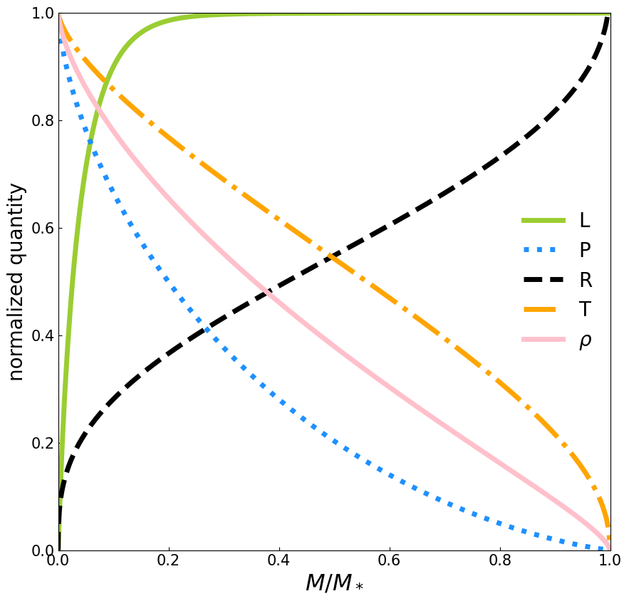

# stellar_structure

A simulation of spherically symmetric ZAMS star with a homogeneous elemental abundance.

Contents:
- ```stellar_model.py```: main code
- ```modeling.ipynb```: an example use on Jupyter notebook
- ```data/fitted_*.csv```: an output in the machine-readable format
- ```Stellar_Structure_calculation_report.pdf```: a quick writeup


